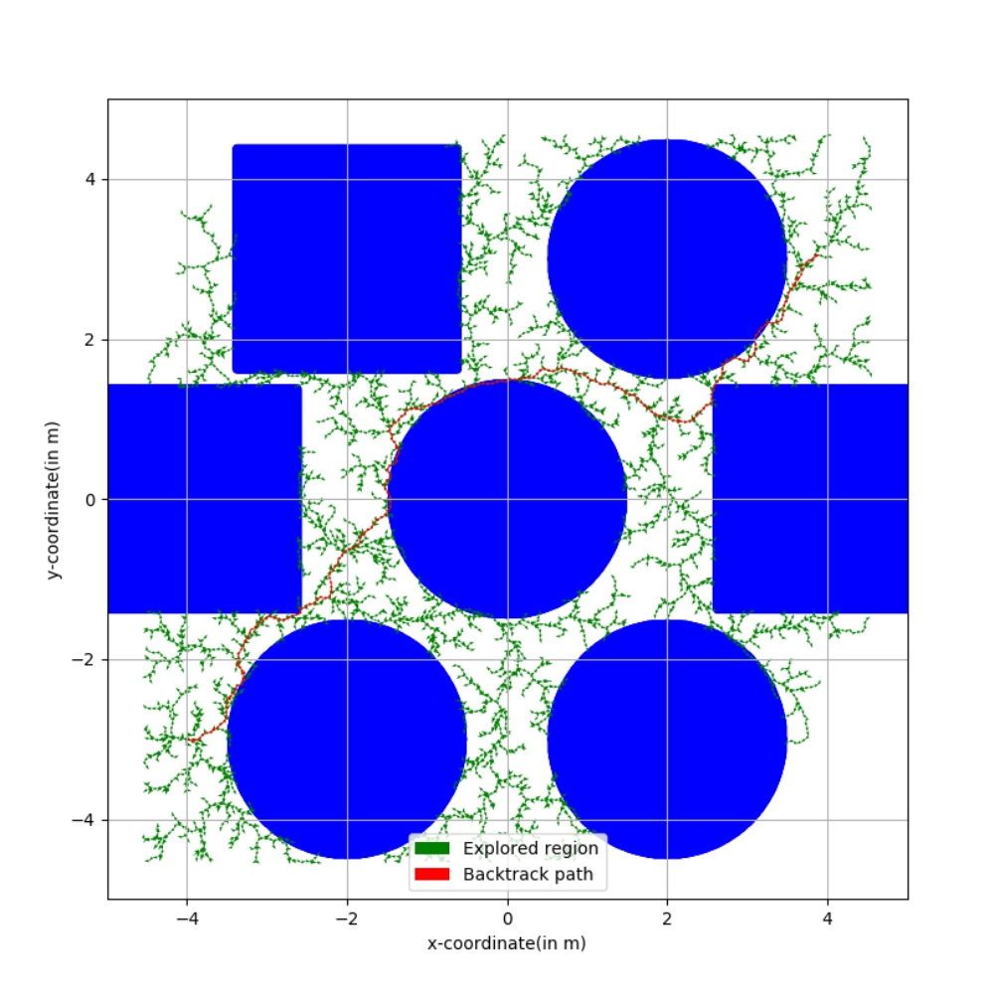
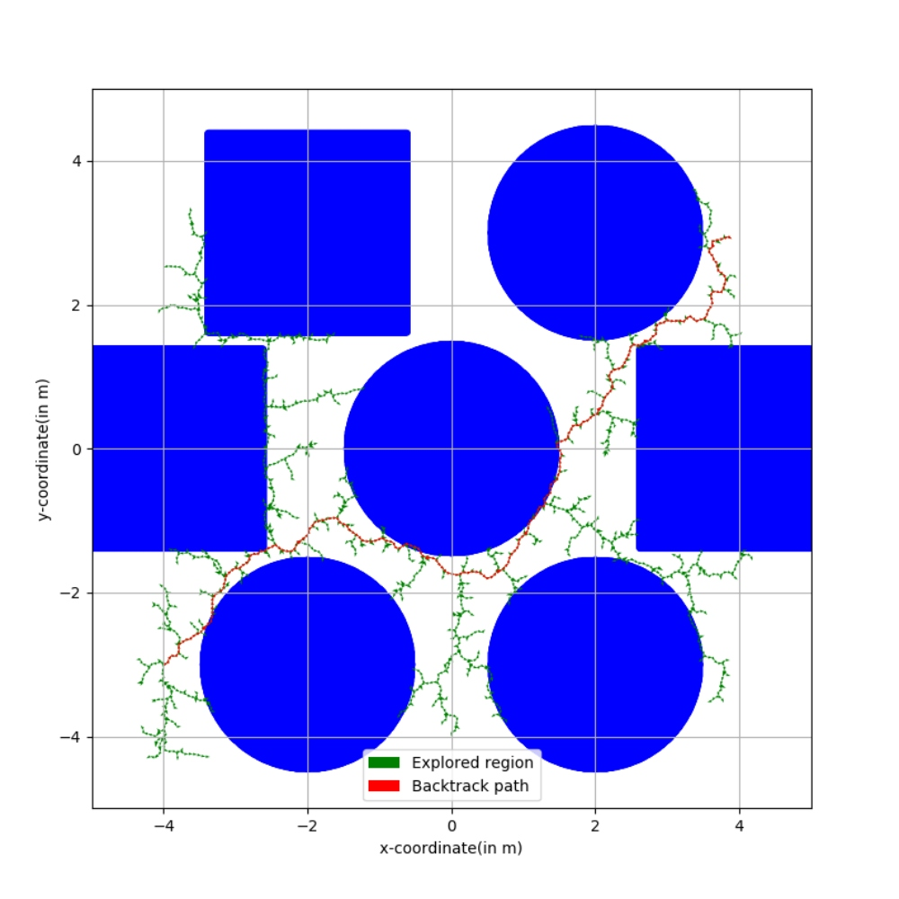

# ROS-based Path Planning for Turtlebot Robot using Informed RRT* algorithm

[](LICENSE.md)
---


### Author
Arpit Aggarwal


### Introduction to the Project
In this project, the Informed RRT* motion planning algorithm was used on ROS Turtlebot 2 to navigate in a configuration space consisting of static obstacles. The path generated by the Informed RRT* motion planning algorithm
was compared with the path generated by the RRT* motion planning algorithm on the basis of the optimal time and optimal path from the beginning point to the objective point. This helped us verify that Informed RRT* algorithm
outperforms RRT* algorithm in rate of convergence, final solution cost, and ability to find difficult passages while demonstrating less dependence on the state dimension and range of the motion planning problem.


### Results
The results obtained using Informed RRT-star algorithm on a rigid robot:


The results obtained using RRT-star algorithm on a rigid robot:



### Software Required
To run the code, you will need to install numpy, rospy, matplotlib and gazebo.


### Simulation platforms used
For the simulations, we used the gazebo and turtlebot2 package. The world file is located in the world folder and defines the setup of the gazebo environment.


### Instructions for running the code
For running the code, follow the detailed instructions given below.
First we create a catkin workspace for our project

```
mkdir -p ~/catkin_ws/src
cd ~/catkin_ws
catkin_make
```

After creating your catkin workspace change your directory to src and clone this repository

```
cd ~/catkin_ws/src
git clone --recursive https://github.com/arp95/turtlebot_rrt.git
cd ../
catkin_make
```

After cloning the repository lets create an executable for our .py file that contains the code to run our program.

```
cd ~/catkin_ws/src/turtlebot_rrt/scripts
chmod +x turtlebot_rrt.py
cd ../../../
catkin_make
```

Once all the above steps have been performed lets source our catkin workspace and then run the program

```
source ./devel/setup.bash
roslaunch turtlebot_rrt demo.launch x:=4 y:=3 yaw:=0
```

Above as you can see in the end, we have given the x,y and yaw arguments in the command line. This indicates the initial spawn position of the turtlebot in the gazebo environment. The coordinates are represented by (x,y) and the orientation is given by the yaw argument.
Once you run the environment a second terminal will pop up in which you need to enter the following information:

```
x coordinate for the start node(in meters, same as the one given in the roslaunch command):
y coordinate for the start node(in meters, same as the one given in the roslaunch command):
x-coordinate of the goal node(in meters):
y-coordinate of the goal node(in meters):
```

After entering all these values in the terminal, the Informed RRT-star algorithm finds the optimum path between the entered start node and goal node.


### Credits
The following links were helpful for this project:
1. https://github.com/Mayavan/RRT-star-path-planning-with-turtlebot
2. https://arxiv.org/abs/1404.2334
3. https://github.com/AtsushiSakai/PythonRobotics
